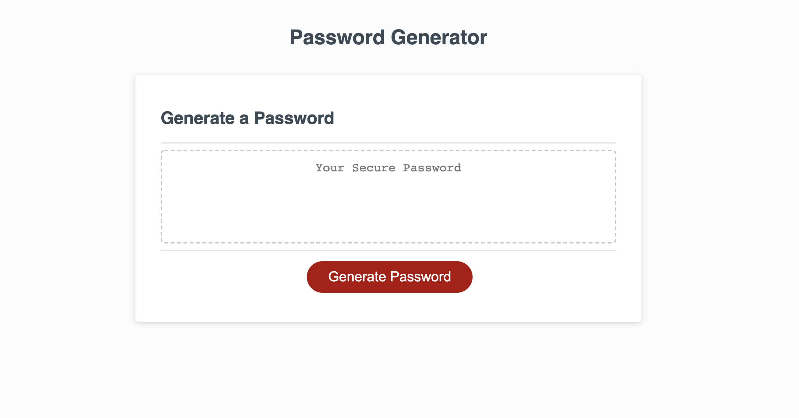

This ReadMe is for a random password generator. 

The random password generator was made primarily using javascript with an HTML and CSS file that was provided by the University of Denver Coding Bootcamp.

The reason that this random password generator was made was to provide practice in psuedocoding, writing javascript code, and understanding how loops, functions, and variables work in Javascript.

I found this assignment to be rather challenging but what really helped me was creating a framework in psuedocode to help me follow my logic better. I had quite a bit of trouble understanding what functions to use to actually generate the password, but the prompts and confirm statements and the loops that went with those statements came to me naturely. 

I want to thank my classmates, TA's, and the tutors provided with the program that helped me get through this random password generator. 

